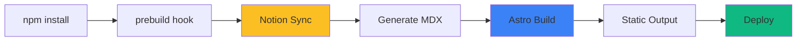

The build process transforms Notion content and Astro components into a fully static website. This page explains each stage of the pipeline.

## Build Pipeline Overview



## Build Stages

<Steps>
  <Step title="Install Dependencies">
    Package manager installs all dependencies:
    
    ```bash
    pnpm install
    ```
    
    **Duration**: 30-60 seconds (cached after first build)
    
    **Key dependencies**:
    - `astro` - Static site generator
    - `@notionhq/client` - Notion API client
    - `solid-js`, `react` - UI frameworks
    - `tailwindcss` - Styling
    - `sharp` - Image optimization
  </Step>
  
  <Step title="Prebuild Hook">
    The `prebuild` script runs automatically before the build:
    
    ```json package.json
    {
      "scripts": {
        "prebuild": "jiti scripts/index.ts",
        "build": "astro build"
      }
    }
    ```
    
    This executes the Notion sync script using `jiti` (TypeScript runner).
  </Step>
  
  <Step title="Notion Content Sync">
    The sync script (`scripts/index.ts`) fetches content from Notion:
    
    ```typescript scripts/index.ts
    import "dotenv/config";
    import { downloadPostsAsMdx } from "../src/lib/notion-download";

    downloadPostsAsMdx("blog");
    downloadPostsAsMdx("projects");

    console.log("Finished downloading content.");
    ```
    
    **Duration**: 10-60 seconds (depending on content changes)
    
    For each collection, the sync process:
    1. Queries Notion database for published posts
    2. Checks which posts need updating (incremental sync)
    3. Fetches blocks for changed posts
    4. Converts blocks to Markdown
    5. Downloads images/assets
    6. Writes MDX files with frontmatter
    
    See [Content Sync](/architecture/content-sync) for detailed explanation.
  </Step>
  
  <Step title="Astro Build">
    Astro builds the static site:
    
    ```bash
    astro build
    ```
    
    **Duration**: 1-2 minutes
    
    Build process:
    1. **Content collections**: Load and validate MDX files
    2. **Static pages**: Render all routes at build time
    3. **Component compilation**: Astro, React, and Solid.js components
    4. **Asset optimization**: Images, CSS, fonts
    5. **Bundle generation**: Create optimized JavaScript bundles
    6. **HTML generation**: Render final HTML for each page
  </Step>
  
  <Step title="Output Generation">
    Astro generates the `dist/` directory:
    
    ```
    dist/
    ├── index.html              # Home page
    ├── blog/
    │   ├── index.html         # Blog listing
    │   └── [slug].html        # Individual posts
    ├── projects/
    │   ├── index.html         # Projects listing
    │   └── [slug].html        # Individual projects
    ├── _astro/                # Bundled assets
    │   ├── *.css             # Compiled Tailwind CSS
    │   └── *.js              # JavaScript bundles
    ├── assets/                # Static images
    └── fonts/                 # Variable fonts
    ```
    
    All pages are pre-rendered as static HTML.
  </Step>
</Steps>

## Optimization Strategies

### Incremental Content Sync

The sync process only updates files that changed in Notion:

```typescript src/lib/notion-download.ts
async function shouldUpdateLocalFile(
  serverLastEditedTime: string,
  srcContentPath: string,
  postId: string
): Promise<boolean> {
  try {
    // Read lastEditedTime from existing MDX file
    const dest = path.join(process.cwd(), "src", "content", srcContentPath, postId).concat(".mdx");
    const readStream = fs.createReadStream(dest);
    // ... read lastEditedTime from frontmatter
    
    // Only update if server time is newer
    return `'${serverLastEditedTime}'` > lastEditedTime;
  } catch (err) {
    // File doesn't exist, fetch it
    return true;
  }
}
```

**Benefits**:
- Faster builds (only fetch changed content)
- Reduced Notion API usage
- Lower bandwidth consumption

### Asset Optimization

<Tabs>
  <Tab title="Images">
    Images are optimized using Astro's built-in Image component:
    
    ```astro
    ---
    import { Image } from 'astro:assets';
    ---
    
    <Image src={imagePath} alt="Description" />
    ```
    
    **Optimizations applied**:
    - Automatic WebP/AVIF conversion
    - Responsive image generation
    - Lazy loading
    - Width/height attributes (no CLS)
    
    Original images from Notion are downloaded to `public/` during sync.
  </Tab>
  
  <Tab title="CSS">
    Tailwind CSS is compiled and optimized:
    
    - Unused classes are purged
    - CSS is minified
    - Single stylesheet per page
    - Inlined critical CSS (optional)
    
    **Output size**: ~10-20KB compressed
  </Tab>
  
  <Tab title="JavaScript">
    JavaScript bundles are generated per-page:
    
    - **Astro pages**: 0KB JavaScript
    - **Solid.js components**: ~30-40KB (for interactive pages only)
    - **React**: Only used for Image component (build-time only)
    
    Bundles are:
    - Minified
    - Code-split
    - Loaded on-demand (Solid.js uses `client:only`)
  </Tab>
  
  <Tab title="Fonts">
    Variable fonts are optimized:
    
    - Preloaded in HTML head
    - Subset to required characters (if configured)
    - Cached for 180 days on Vercel
    
    ```html
    <link
      rel="preload"
      href="/fonts/Inter.woff2"
      as="font"
      type="font/woff2"
      crossorigin
    />
    ```
  </Tab>
</Tabs>

## Build Performance

### Build Time Breakdown

<CardGroup cols={2}>
  <Card title="Cold Build" icon="snowflake">
    **Total**: 3-5 minutes
    
    - Dependencies: 1-2 min
    - Notion sync: 30-60 sec
    - Astro build: 1-2 min
    - Deploy: 30 sec
  </Card>
  
  <Card title="Incremental Build" icon="gauge-high">
    **Total**: 2-3 minutes
    
    - Dependencies: 30 sec (cached)
    - Notion sync: 10-20 sec
    - Astro build: 1-2 min
    - Deploy: 30 sec
  </Card>
</CardGroup>

### Output Size

```
Total: ~2-5 MB (uncompressed)
├── HTML: ~500 KB
├── CSS: ~20 KB
├── JavaScript: ~50 KB
├── Images: ~1-3 MB
└── Fonts: ~400 KB

Compressed (Brotli): ~500 KB - 1 MB
```

## Environment Variables

Environment variables are used during the build:

<Accordion title="Build-Time Variables">
  These are embedded into the static output:
  
  ```typescript
  const siteUrl = import.meta.env.SITE_URL;
  ```
  
  **Used for**:
  - Site URL in meta tags
  - Canonical URLs
  - Open Graph images
</Accordion>

<Accordion title="Secret Variables">
  These are only available during build (not in browser):
  
  ```typescript
  const notionToken = import.meta.env.NOTION_TOKEN;
  ```
  
  **Used for**:
  - Notion API authentication
  - Database queries
  - Asset downloads
  
  <Warning>
    Never expose secret variables in client-side code. They're only available in `.astro` files and server-side scripts.
  </Warning>
</Accordion>

## Build Hooks

You can customize the build process:

### Adding Custom Steps

Modify `scripts/index.ts` to add custom build steps:

```typescript scripts/index.ts
import "dotenv/config";
import { downloadPostsAsMdx } from "../src/lib/notion-download";

// Existing steps
await downloadPostsAsMdx("blog");
await downloadPostsAsMdx("projects");

// Add custom steps
import { generateSitemap } from "./generate-sitemap";
await generateSitemap();

import { optimizeImages } from "./optimize-images";
await optimizeImages();

console.log("Finished downloading content.");
```

### Skipping Notion Sync

For faster local builds, skip Notion sync:

```bash
# Skip prebuild hook
SKIP_NOTION_SYNC=true pnpm build
```

Modify `scripts/index.ts`:

```typescript
if (process.env.SKIP_NOTION_SYNC !== 'true') {
  await downloadPostsAsMdx("blog");
  await downloadPostsAsMdx("projects");
} else {
  console.log("Skipping Notion sync (SKIP_NOTION_SYNC=true)");
}
```

## Debugging Build Issues

<Steps>
  <Step title="Enable Verbose Logging">
    Add debug output to the sync script:
    
    ```typescript
    console.log(`Fetching ${posts.length} posts from Notion...`);
    console.log(`Updated ${updatedCount} posts`);
    ```
  </Step>
  
  <Step title="Check Build Logs">
    On Vercel, view detailed logs:
    
    1. Go to **Deployments**
    2. Click the deployment
    3. View **Build Logs** tab
    
    Look for:
    - Notion API errors
    - MDX parsing errors
    - Asset download failures
  </Step>
  
  <Step title="Local Build Testing">
    Test the full build locally:
    
    ```bash
    pnpm build
    pnpm preview
    ```
    
    This runs the exact same process as production.
  </Step>
</Steps>

## Caching Strategy

<CardGroup cols={2}>
  <Card title="Build Cache" icon="database">
    Vercel caches:
    - `node_modules/` (dependencies)
    - `.astro/` (Astro build cache)
    - `pnpm-lock.yaml` (lockfile)
    
    **Invalidated by**:
    - Changes to `package.json`
    - Manual cache clear
  </Card>
  
  <Card title="Content Cache" icon="file">
    Notion content is cached:
    - In `src/content/` as MDX files
    - Incremental sync checks timestamps
    - Revalidated on every build
    
    **Invalidated by**:
    - Changes in Notion (lastEditedTime)
    - Manual file deletion
  </Card>
</CardGroup>

## Next Steps

<CardGroup cols={2}>
  <Card title="Vercel Deployment" href="/deployment/vercel" icon="arrow-up-right-from-square">
    Configure Vercel deployment
  </Card>
  
  <Card title="Content Sync" href="/architecture/content-sync" icon="arrows-rotate">
    Deep dive into Notion sync process
  </Card>
</CardGroup>
