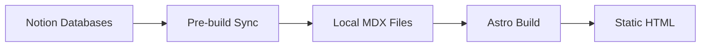

# Welcome to Andrew Gao's Personal Website

This is an open-source personal website built with [Astro 5.x](https://astro.build) and powered by [Notion](https://notion.so) as a headless CMS. The site demonstrates a modern static site generation workflow with dynamic content management.

<Info>
  **Live Site:** [www.andrewgao.org](https://www.andrewgao.org/)
</Info>

## What Makes This Project Unique

This website showcases a production-ready architecture that combines the best of static site generation with the flexibility of a content management system:

<CardGroup cols={2}>
  <Card title="Notion-Powered CMS" icon="database">
    Content lives in Notion databases and syncs automatically at build time, giving you a familiar editing experience without runtime API overhead.
  </Card>
  
  <Card title="Modern Stack" icon="rocket">
    Built with Astro 5.x, React 19, and Solid.js for optimal performance and developer experience.
  </Card>
  
  <Card title="Pre-Build Sync" icon="sync">
    Smart incremental sync only updates content that changed, keeping builds fast and efficient.
  </Card>
  
  <Card title="Type-Safe" icon="shield">
    Full TypeScript support with Zod schemas for content validation and type safety.
  </Card>
</CardGroup>

## Core Features

### Content Management
- **Blog posts** and **project portfolios** managed entirely in Notion
- **Knowledge base** with reading logs organized by year
- **Interactive map** visualization of places visited
- **Dynamic navigation** generated from Notion database

### Technical Highlights
- **Static Site Generation (SSG)** for optimal performance
- **Multi-framework approach**: Astro + React + Solid.js
- **Tailwind CSS 4.x** with custom variable fonts (Inter, Newsreader)
- **MDX support** with rich Notion block conversion
- **SEO-optimized** with automatic sitemap generation
- **Vitest** for testing with coverage reports

## Architecture Overview

The site follows a build-time content synchronization pattern:

**Why this approach?**
- **Performance**: Static generation is faster than runtime API calls
- **Reliability**: Site works even if Notion API is down
- **Cost**: No API rate limit concerns in production
- **Incremental**: Only syncs content that changed since last build

## Quick Navigation

<CardGroup cols={2}>
  <Card title="Quick Start" icon="play" href="/quickstart">
    Get the site running locally in under 5 minutes
  </Card>
  
  <Card title="Environment Setup" icon="gear" href="/environment-setup">
    Configure Notion integration and environment variables
  </Card>
  
  <Card title="Project Structure" icon="folder-tree">
    Explore the codebase organization and key files
  </Card>
  
  <Card title="Notion Integration" icon="book">
    Learn how content syncs from Notion to MDX
  </Card>
</CardGroup>

## Tech Stack Summary

| Category | Technology | Version |
|----------|------------|----------|
| Framework | Astro | 5.16.9 |
| UI Libraries | React | 19.2.3 |
| | Solid.js | 1.9.10 |
| Styling | Tailwind CSS | 4.1.18 |
| CMS | Notion API | 5.6.0 |
| Package Manager | pnpm | Latest |
| Deployment | Vercel | - |
| Testing | Vitest | 4.0.17 |

## Who Is This For?

This project is perfect for:
- **Developers** building personal websites with a CMS-driven approach
- **Content creators** who want to write in Notion but publish to a static site
- **Learners** studying modern web development patterns
- **Teams** looking for inspiration on Astro + Notion integration

<Note>
  This is a real production website, not a demo. All code examples in this documentation are extracted from the actual source code.
</Note>

## Next Steps

<Steps>
  <Step title="Quick Start">
    Follow the [Quick Start Guide](/quickstart) to clone the repo and run it locally
  </Step>
  
  <Step title="Set Up Notion">
    Configure your [environment variables](/environment-setup) and connect to Notion
  </Step>
  
  <Step title="Explore the Code">
    Dive into the source to understand the architecture and customization options
  </Step>
</Steps>

## Community & Support

This is an open-source project. Feel free to explore, learn from, and adapt the code for your own needs.

<Warning>
  Make sure to create your own Notion integration and databases. Don't use the production credentials from this project.
</Warning>